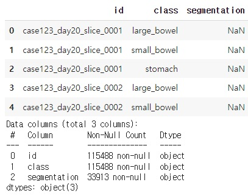
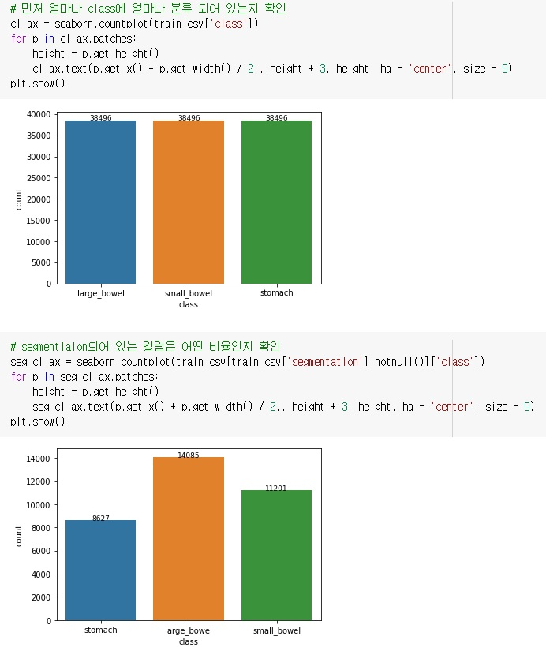
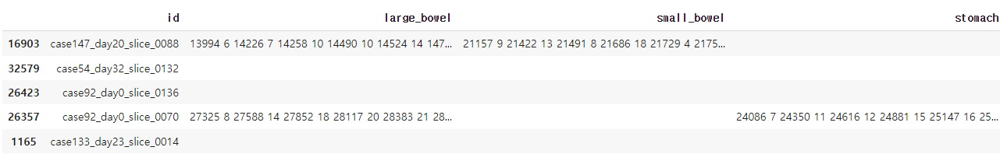
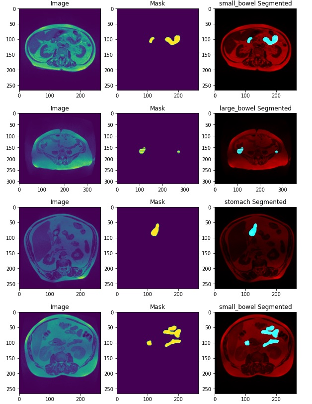

# MRI 데이터를 활용한 이미지 세그멘테이션 

##### 딥러닝 프로젝트 3조
##### 강태혁, 김수진, 백재선, 신우경
___

## 기획의도 & 배경
- 파이널 프로젝트 전 이미지 세그멘테이션(image segmentaion) 연습
- 의료분야에서도 활발한 AI 연구
- 의료법과 개인정보법에 의해서 쉽게 수집하고 활용할 수 없는 의료데이터
- 캐글 데이터 중 의료데이터 이미지 세그멘테이션 대회 데이터셋 활용
![Dataset]<https://www.kaggle.com/competitions/uw-madison-gi-tract-image-segmentation/data>

___

## Dataset 이해

#### 1. 데이터셋 summary

- 약 11만여개 데이터, 세그멘테이션 된 데이터는 약 3만개

#### 2. 전체 데이터는 어떻게 라벨링 되어 있는지

- 1개 케이스에 위, 대장, 소장 라벨링

#### 3. 세그멘테이션 된 데이터의 비율

- 25%/ 42% / 33%

#### 4. 세그멘테이션 된 데이터의 데이터 마스크

- rle로 되어 있음

**rle 형식** 
_매우 간단한 비손실 압축 방법. 데이터에서 같은 값이 연속해서 나타나는 것을 그 개수와 반복되는 값만으로 표현하는 방법. 아이콘 등의 간단한 이미지와 같이 연속된 값이 많이 있는 데이터에 효과적._

예시)
27325 8 -> 27325, 27326, 27327, 27328, 27329 , 27330, 273231 , 27332 8개를 뜻함.

#### 5. 원본, 마스크, 겹쳐보기 이미지 

전처리

(전처리 이미지 순서대로 첨부)

마지막에 세그멘테이션 된 데이터 활용을 위하여 카운트가 0인 것은 삭제 후 인덱스 초기화 (이미지 첨부)

학습
(04.train01-Stratified Group KFold .jpg 이미지 첨부)

Stratified Group KFold란?
타겟 데이터의 분포를 유지하며 Train/Valid set을 나누는 Stratified K Fold와 동일한 그룹(= 같은 이미지)에서 나온 데이터가 Train set과 Valid set에 동시에 포함되지 않도록 하는 Group K Fold를 결합한 방법.

Stratified Group KFold 사용 이유
한 이미지에 여러 개의 Object가 있는 데이터셋. 1개의 데이터에 여러 개의 label이 붙어있음.
이미지 단위로 Train set과 Validation set을 나누게 될 경우, 특정한 Object가 Validation set에 아예 포함되지 않거나, 지나치게 많게 혹은 적게 포함되는 경우가 발생. 이를 해결하기 위해 Stratified Group KFold 사용. 

성능평가 지표 -  dice, iou, loss
dice 지표 - 영상 이미지등에서 정답과 예측값간의 차이를 알기위해 사용. F1 Score와 개념상 같지만, 이미지, 영상처리에서 더 강조를 하는 경향.
iou - 
Dice Loss - Loss는 어떤 학습된 모델을 실제 데이터에 적용했을 때 모델의 추정 오차로 인해 발생하는 손실. Dice loss 는 segmentation 구조에 많이 사용되는 손실함수.

학습에 사용 모델 
(사용 모델 레이어 다 복사에서 접기가 가능하도록 해주세요)

unet 설명(이미지)
unet의 장점
적은 양의 학습 데이터로도 Data Augmentation을 활용해 여러 Biomedical Image Segmentation 문제에서 우수한 성능을 보임
컨텍스트 정보를 잘 사용하면서도 정확히 지역화함
End-to-End 구조로 속도가 빠름
속도가 빠른 이유는 검증이 끝난 곳은 건너뛰고 다음 Patch부터 새 검증을 하기 때문.

efficientnetb7 설명
네트워크의 Depth, Width, Resolution 간의 조율(Balance)을 통해, 효과적이면서 좋은 성능을 얻음
적은 파라미터로 효율적인 성능. 쉬운 Architecture 구성으로 높은 성능을 가져올 수 있음.

학습

7ch 결론

1-1) count = 0  삭제한 케이스 과적합 문제 발생. 검증 데이터와 심한 괴리가 존재
1-2) 삭제 안한 케이스가 0 삭제한 케이스보다 더 좋은 성능

=====
reference

eda
https://www.kaggle.com/code/fismoilo/gi-tract-image-segmentation-setup-visualization
train and valid 
https://www.kaggle.com/code/ammarnassanalhajali/uwmgi-unet-keras-train-with-eda/notebook
 
